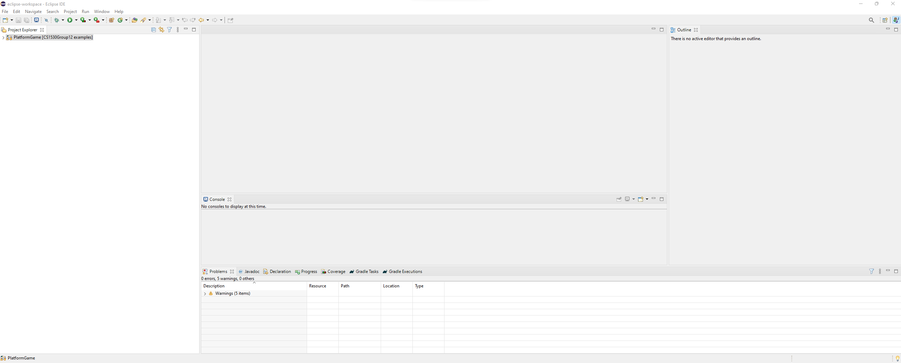
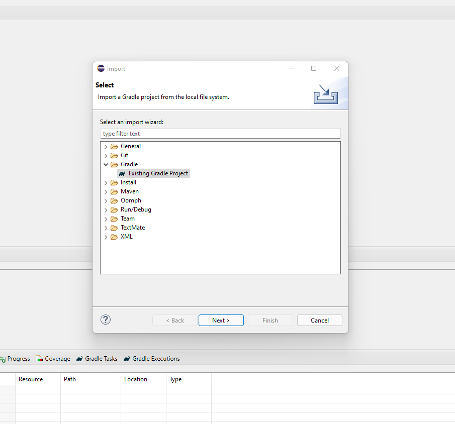
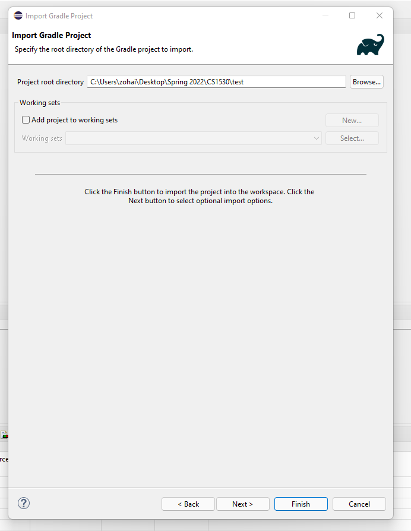
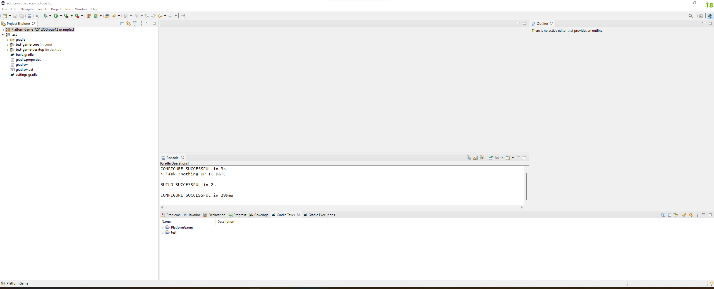

# Project Examples

This branch contains some project demos I put together by myself or by watching tutorials.

## Setup and Running the Projects

To run the projects on eclipse, open the empty eclipse editor.

Go to File in the top left corner and click import and then choose the import gradle project option.

Locate the directory where you generated your game folder from the libGDX generator and add its path to the import wizard.

 

Finally, locate the "_____-desktop" folder in the gradle project imported and find the DesktopLauncher.java class. Right
click on it and run as java application. Your game should launch with a separate window.

